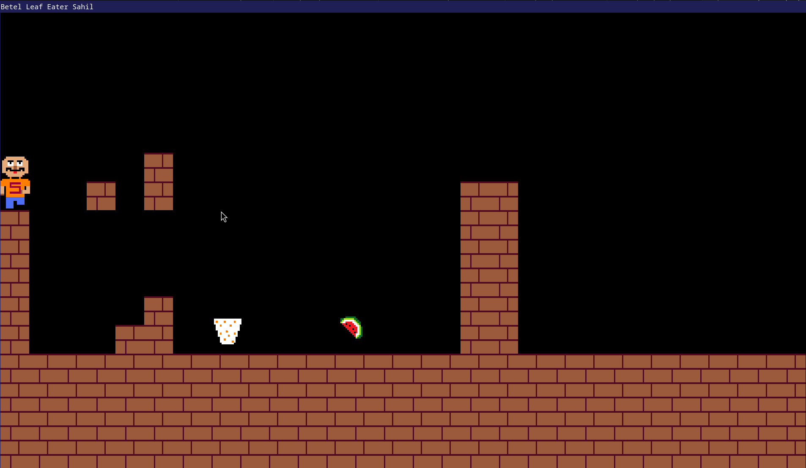
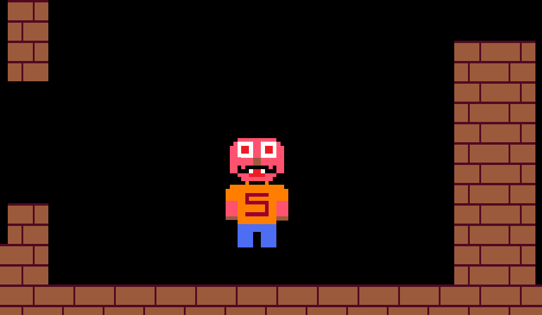

# BetelLeafEater

BetelLeafEater is a custom-built 2D game and game engine written in modern C++ using the SDL2 library. It features a fully self-developed physics system, rendering engine, and sprite management — with no external libraries beyond SDL2 and SDL2_image.

This project is ideal for those interested in understanding how games work at a low level by building essential systems from scratch.

---

### Features

- Game engine built from scratch
- Custom physics engine
- Tilemap-based rendering (map data loaded from files)
- Component-based architecture for entities
- Texture and sprite management system

---

### Screenshots

---

### Requirements

- C++20 compatible compiler
- CMake ≥ 3.10
- SDL2
- SDL2_image

---

### Build Instructions

```bash
# Clone the repository
git clone https://github.com/yourusername/BetelLeafEater.git
cd BetelLeafEater

# Create a build directory
mkdir build && cd build

# Run CMake
cmake ..

# Build the project
cmake --build . && cd ..

# Play the game !
./build/BetelLeafEater
```

This generates an executable `./build/BetelLeafEater`, which is to be executed as the program.
Make sure you run the executable while being in the root project directory.

---

# Map File

The game loads level data from an external file and renders it using a tilemap system. Maps are plain-text based and easily customizable.

---

### Goal

The goal of BetelLeafEater is to build a minimal but functional game engine from the ground up to better understand how core systems in games are structured — including physics, rendering, and asset management — without relying on high-level engines or libraries.

---

### Screenshots




---

### Contributors

- Dhruv Chouhan [ecxtacy](https://github.com/ecxtacy) [dc.dhruvchouhan@gmail.com](mailto:dc.dhruvchouhan@gmail.com)

---

### 📜 License

This project is licensed under the [MIT License](LICENSE).
